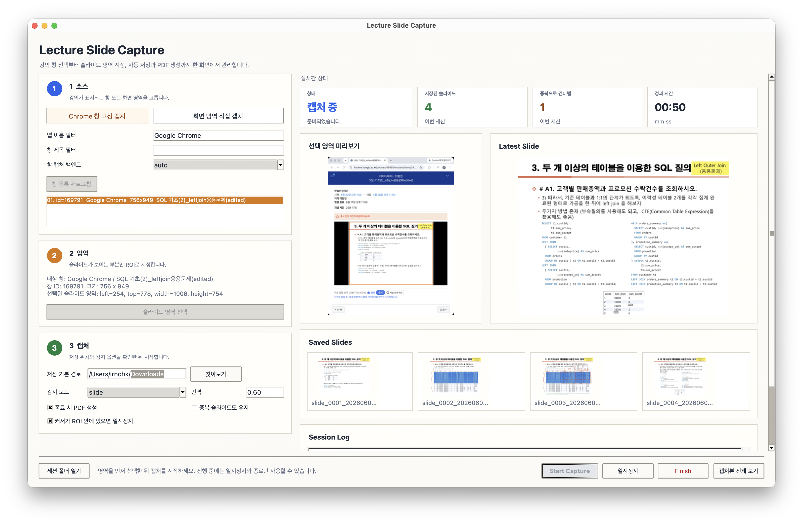

# Lecture Slide Capture

Local-first desktop app that watches a lecture video or browser window, saves only the moments when slides change, and exports the captured slides as images plus a `slides.pdf`.



## Why This Exists

Lecture recordings are often long, repetitive, and difficult to review. Students usually need the slide states, not a full video recording. Lecture Slide Capture turns a live lecture window into a compact study artifact by detecting slide transitions locally and saving only meaningful frames.

The app is designed for privacy-sensitive study workflows:

- It runs on the user's machine.
- It does not upload lecture video or screenshots to a server.
- It stores slide images, logs, and the generated PDF in a local session folder.
- It works with a browser window or a manually selected screen region.

## Who It Helps

- Students reviewing online lectures without manually screenshotting every slide.
- Educators and TAs who want quick slide snapshots from recorded lectures.
- Researchers building local-first note-taking and lecture-processing workflows.
- Accessibility-minded users who need a compact PDF view of visual lecture material.

## Features

- Select a Chrome lecture window or a screen region from the GUI.
- Pick a slide ROI so browser chrome, captions, and controls can be excluded.
- Save images only when slide transitions are detected.
- Review the latest saved slide and recent saved slides while capture runs.
- Generate `slides.pdf` when the session ends.
- Pause, resume, and finish capture safely.
- Remember the output directory between sessions.
- Switch between English and Korean from the app language setting.
- Package a runnable macOS `.app` bundle and Windows build files.

## Quick Start

### macOS

1. Open `Lecture Slide Capture.app`.
2. If Python packages are missing, run the install command shown by the app.
3. Choose a Chrome lecture window or screen region.
4. Select the slide area.
5. Press `Start Capture`.
6. When finished, press `Finish` to generate `slides.pdf`.

macOS Screen Recording permission may be required. If capture returns a blank image, grant permission in System Settings and restart the app.

### Windows

Build on Windows or run the GitHub Actions `Build Windows` workflow. PyInstaller cannot cross-compile a Windows executable from macOS.

```powershell
.\scripts\build_windows.ps1
```

The distributable executable is created at:

```text
dist\LectureSlideCapture.exe
```

## Output

Each run creates a timestamped session folder under the selected base output directory. The base directory is editable in the GUI and saved locally.

Typical session contents:

```text
slide_0001.png
slide_0002.png
slides.pdf
captures.csv
duplicates.csv
capture_source.json
```

## Repository Contents

```text
Lecture Slide Capture.app/
  Contents/Resources/slide_capture_gui.py   GUI frontend
  Contents/Resources/slide_capture.py       capture engine
  Contents/Resources/requirements.txt       Python dependencies
design/
  lecture-slide-capture-app-screenshot.png  App screenshot
packaging/windows/
  LectureSlideCapture.windows.spec          PyInstaller spec
scripts/
  build_windows.ps1                         Windows build script
```

## Validation

The current app bundle has been checked with:

```sh
python3 -m py_compile "Lecture Slide Capture.app/Contents/Resources/slide_capture_gui.py" \
  "Lecture Slide Capture.app/Contents/Resources/slide_capture.py"
bash -n "Lecture Slide Capture.app/Contents/Resources/run_capture_in_terminal.sh"
```

End-to-end capture still depends on OS screen-recording permissions and an available lecture window.

## Roadmap

- Improve Windows window-capture reliability and packaging documentation.
- Add small sample fixtures for slide-transition detection regressions.
- Add clearer first-run diagnostics for missing screen permissions.
- Improve keyboard navigation and accessibility in the Tkinter GUI.
- Publish downloadable release artifacts for macOS and Windows.

## Contributing

Issues and pull requests are welcome. See [CONTRIBUTING.md](./CONTRIBUTING.md) for development notes, privacy expectations, and suggested contributions.

## License

MIT. See [LICENSE](./LICENSE).

## Korean

한국어 설명은 [README_ko.md](./README_ko.md)를 참고해 주세요.
